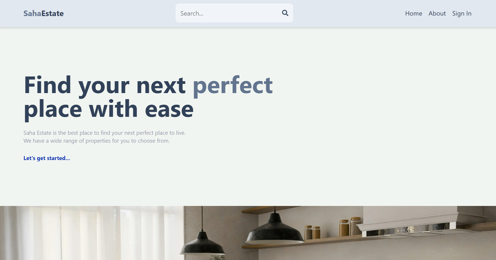
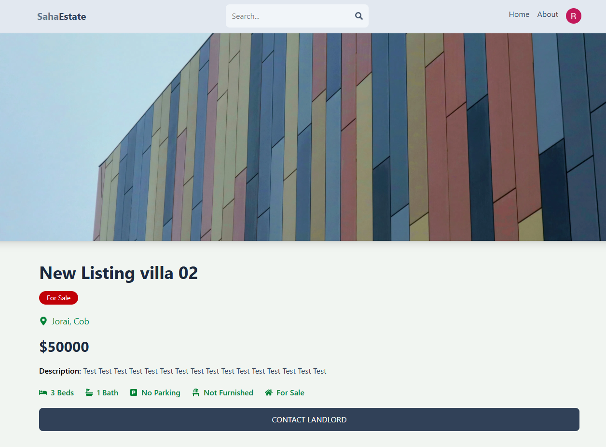
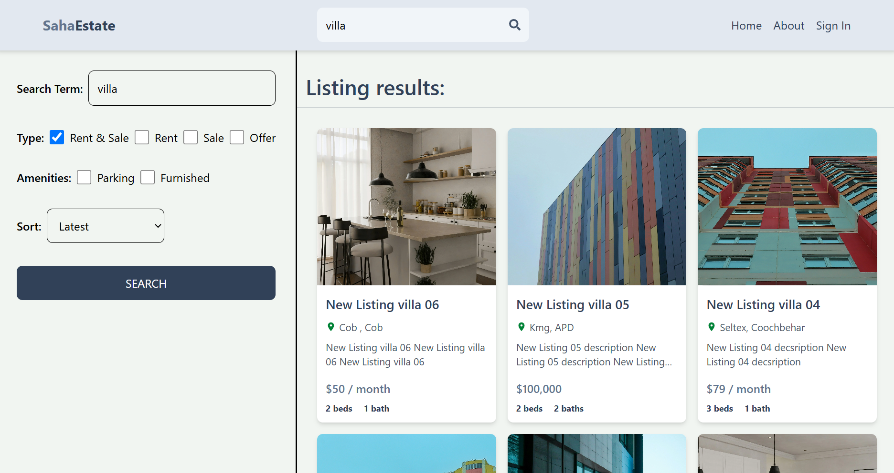

# Saha Estate

Full-stack MERN real estate platform where users can securely buy, sell, and rent properties with authentication, property management, advanced search, cloud image uploads, and landlord contact.

### 🔗 Live Demo

[Saha Estate](https://saha-estate.onrender.com/)

## 🛠️ Built With




## ✨ Key Features

- 🏡 **Property Management** — Create, edit, and manage property listings.
- 🔍 **Advanced Search** — Search, filter, sort, and browse properties with pagination.
- 👤 **Secure Authentication** — Email/Password and Google Sign-In with protected user accounts.
- 🖼️ **Cloud Image Uploads** — Upload multiple property images using ImageKit.
- 📧 **Contact Landlords** — Connect with property owners directly via email.

## 🖥️ Application Preview

### Property Details

Users can browse property details, view multiple images, property amenities, and contact the landlord directly.



### Search & Filtering

Users can search properties by name and refine results using filters such as listing type, offers, parking, furnished status, sorting, and pagination.



## ⚙️ Core Functionality

### 🔐 Secure Authentication

Users can sign up with email and password or sign in using Google Authentication. JWT-based authentication protects private routes, while HTTP-only cookies securely manage user sessions.

### 🏡 Property Listing Management

Authenticated users can create, edit, update, and delete their own property listings. Each listing supports multiple property images, pricing, property information, amenities, and location details.

### 🔍 Smart Search & Filtering

The application enables dynamic property discovery using MongoDB queries. Users can search by property name, filter listings by type, offers, parking, and furnished status, sort results by date or price, and browse additional listings through pagination.

### 🖼️ Image Upload & Storage

Property images are uploaded to ImageKit cloud storage, providing optimized image hosting while keeping media separate from the application server.

### 📧 Landlord Communication

Visitors interested in a property can contact the landlord directly from the listing page using the integrated email feature, simplifying communication between buyers, renters, and property owners.

## 📁 Project Structure

```text
saha-estate/
├── api/
│   ├── controllers/      # Request handling and business logic
│   ├── db/               # Database connection
│   ├── middleware/       # Authentication middleware
│   ├── models/           # MongoDB/Mongoose models
│   ├── routes/           # REST API routes
│   ├── utils/            # Helper functions
│   ├── index.js
│   └── package.json
│
├── client/
│   ├── src/
│   │   ├── components/   # Reusable UI components
│   │   ├── pages/        # Application pages
│   │   ├── redux/        # Global state management
│   │   ├── App.jsx
│   │   ├── firebase.js
│   │   └── main.jsx
│   ├── package.json
│   └── vite.config.js
│
├── screenshots/          # README screenshots
└── README.md
```

## 📦 Installation & Setup

### 1. Clone the Repository

```bash
git clone https://github.com/manajitsaha18/saha-estate.git
cd saha-estate
```

### 2. Install Dependencies

Install the backend dependencies from the project root:

```bash
npm install
```

Install the frontend dependencies:

```bash
cd client
npm install
```

### 3. Configure Environment Variables

Create a `.env` file in the **project root** and configure the following variables:

```env
MONGO_URI=your_mongodb_connection_string
JWT_SECRET=your_jwt_secret

IMAGEKIT_PUBLIC_KEY=your_imagekit_public_key
IMAGEKIT_PRIVATE_KEY=your_imagekit_private_key
IMAGEKIT_URL_ENDPOINT=your_imagekit_url_endpoint
```

Create another `.env` file inside the **client** directory:

```env
VITE_FIREBASE_API_KEY=your_firebase_api_key
```

> Replace the placeholder values with your own credentials. Never commit `.env` files or private keys to version control.

### 4. Start the Backend

Open a terminal from the project root and run:

```bash
npm run dev
```

### 5. Start the Frontend

Open another terminal and run:

```bash
cd client
npm run dev
```

The Vite development server will display the local frontend URL in the terminal.

## 🚀 Deployment

The application is deployed on **Render**, with:

- **Frontend:** React (Vite)
- **Backend:** Node.js + Express
- **Database:** MongoDB Atlas
- **Authentication:** Firebase Authentication
- **Image Storage:** ImageKit

Production environment variables are configured securely on the deployment platform.
